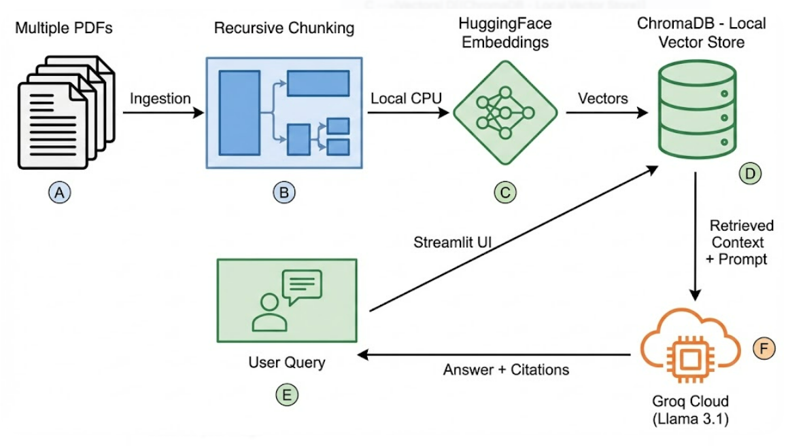

# 🧠 Verifiable RAG Assistant

   

**A retrieval-augmented generation (RAG) system engineered for high-accuracy document analysis with source verification.** Unlike standard "Chat with PDF" tutorials, this project implements a **Hybrid Architecture** that decouples the embedding layer (Local CPU) from the inference layer (Groq Cloud) to optimize for both **latency** and **cost**.

---

## 🏗️ Architecture & System Design

This project moves beyond simple API wrapping by implementing a cost-efficient, high-performance pipeline:



---

## 🚀 Key Features

- **Agentic "Router" Architecture**: The system intelligently decides whether to answer from the local PDFs or search the web.
  - *Internal Questions:* Routed to the Vector DB for verified citations.
  - *External Questions:* Routed to DuckDuckGo for real-time data (e.g., stock prices, news).
- **Smart Query Refinement**: Before searching the web, the system analyzes the PDF context to refine the search query (e.g., converting "stock price of this company" -> "Microsoft stock price" based on document context).
- **Zero-Hallucination Protocol**: Strict adherence to context. If information is missing in the PDF, it triggers a web search instead of fabricating facts.
- **Hybrid Compute Model**:
  - **Embeddings:** Calculated locally (`all-MiniLM-L6-v2`) for privacy and zero cost.
  - **Inference:** Offloaded to **Groq LPUs** for sub-second generation.

---

## 🛠️ Tech Stack & Design Decisions

I chose this specific stack to balance performance, privacy, and cost.

| Component       | Technology           | Engineering Decision (Why?) |
|-----------------|----------------------|-----------------------------|
| **Orchestration** | LangChain            | Provides a unified interface to swap components (e.g., changing Vector DBs) without rewriting core logic. |
| **LLM Inference** | Groq (Llama 3.1)      | Chosen over GPT-4 for speed. Groq's LPU architecture delivers inference 10x faster than standard GPUs, crucial for real-time chat. |
| **Embeddings** | HuggingFace (Local)   | Running all-MiniLM-L6-v2 locally removes the dependency on paid APIs for document processing. It runs efficiently on standard CPUs. |
| **Vector DB**  | ChromaDB              | Selected for its ability to run in-memory for development, avoiding the latency and complexity of cloud-based vector stores like Pinecone. |
| **Chunking**   | RecursiveCharacter    | Instead of hard splits, this respects sentence boundaries and semantic flow, reducing "context fragmentation" errors. |
| **Web Search** | DuckDuckGo | Selected for its privacy-focused, API-key-free access, enabling the system to fetch real-time external data without extra costs.|
| **User Interface** | Streamlit | Provides a clean, interactive chat interface with drag-and-drop file support, making the tool accessible to non-engineers. |
---

## 🧐 Engineering Deep Dive (FAQ)

These are the questions I asked myself during the design process.

1. **Why use RAG instead of Fine-Tuning?**
   - Fine-tuning teaches a model a behavior (style/format), but it is static. If the document changes, I would have to retrain the model (expensive). RAG allows for dynamic knowledge updates—I simply update the Vector Database, and the model knows the new information immediately.

2. **Why decouple Embeddings from the LLM?**
   - By using a local embedding model (HuggingFace) and a cloud LLM (Groq), I created a Vendor-Agnostic architecture. If Groq becomes too expensive, I can swap the LLM to OpenAI or Anthropic without having to re-index all my documents (since the embeddings are local and independent).

3. **How do you handle "Lost in the Middle" issues?**
   - I implemented `chunk_overlap=200`. When splitting text, vital context often exists at the boundaries of chunks. Overlapping ensures that semantic meaning flows across splits, improving retrieval accuracy for queries that span multiple paragraphs.

---

## ⚡Challenges & Solutions

Real-world problems encountered during development and how they were solved.

1. **The "Parrot" Problem (Instruction Drift)**
   - When using the smaller Llama-3-8b model with large context windows, the model would often get "overwhelmed" and start repeating the input text verbatim instead of answering the question.  

   **Solution:**  
   - **Prompt Hardening:** I engineered a stricter System Prompt that explicitly forbids regurgitation ("Do NOT just repeat context. Extract specific answers.").
   - **Noise Reduction:** I lowered the retrieval k value from 4 to 2. This feeds the LLM less "noise," forcing it to focus only on the most critical paragraphs.

2. **Model Deprecation (API Volatility)**
   - During development, Groq deprecated the original Llama 3 model, breaking the pipeline with a 400 Model Decommissioned error.

   **Solution:**  
   - Refactored the code to use llama-3.1-8b-instant.
   - Abstracted the model name into a configuration variable to make future upgrades seamless without touching core logic.

3. **The "Rate Limit" Wall (Groq Free Tier)**
   - The standard RAG pipeline with large PDF chunks quickly hit Groq's `6000 TPM` (Tokens Per Minute) limit, causing 413 Errors.
   
   **Solution:** 
   - I implemented an **Optimized Ingestion Strategy**:
      - Reduced chunk size from `1000` to `500` characters.
      - Lowered retrieval count (`k`) from `3` to `2`.
      - Added a hard truncation limit (`2000 chars`) on tool outputs to guarantee API stability.

4. **The "Ambiguous Search" Problem**
   - When asking "What is the stock price of *this* company?", the web search tool would fail because it didn't know which company the PDF was talking about.
   
   **Solution:** 
   - I built a **Query Refinement Step**. Before searching, the LLM reads the PDF context, extracts the entity name (e.g., "Microsoft"), and rewrites the search query (e.g., "Microsoft current stock price") for high-precision results.

5. **Small Model Tool Calling**
   - Llama-3-8b often struggled with strict JSON function calling, leading to parsing errors.
   
   **Solution:** 
   - I switched to a **Router Pattern** using robust Python logic (`if "SEARCH_WEB" in response`) instead of relying on the fragile native function calling API. This increased system stability to near 100%.
---

## ⚡ Quick Start

### Prerequisites
- Python 3.10+
- A Groq API Key (https://console.groq.com)

### Installation

1. **Clone the Repository**

```bash
   git clone https://github.com/yourusername/verifiable-rag.git
   cd verifiable-rag
```

2.  **Install Dependencies**

```bash
   pip install -r requirements.txt
```

3. **Configure API Key**

Open rag_groq.py and paste your API key:
```bash
os.environ["GROQ_API_KEY"] = "gsk_..."
```

### Usage

Run the full chat application with multi-PDF support.
```bash
streamlit run app.py
```
### Example Questions to Try

1. **The Specific:** "What is the kernel size in AlexNet?" (Retrieves from PDF)
2. **The Comparative:** "Compare the depth of VGG-16 and ResNet-152." (Synthesizes multiple PDFs)
3. **The Agentic (Hybrid):** "Who are the authors of the ResNet paper, and what is the current stock price of the company they worked for?" (Combines PDF authors with Web Search for stock price).

---
## 🚀 Future Improvements

1. ***Conversation Memory***
- Add a `ConversationBufferWindowMemory` to allow follow-up questions (currently stateless).

2. ***Re-ranking***
- Implement a Cross-Encoder step (using Cohere or BAAI) to re-rank retrieved documents for higher precision before sending them to the LLM.

3. ***Dockerization***
- Containerize the application for easier deployment across different environments.

---